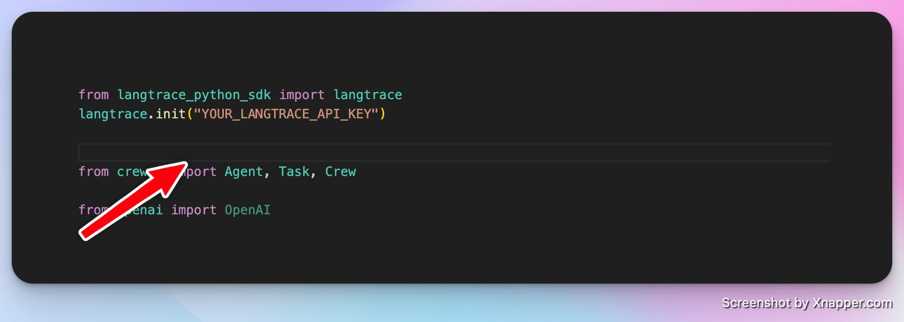

## Follow these steps to get the ai chatbot up and running:

If you would like to learn how to run evaluations with this chatbot on Langtrace check this [article](https://medium.com/langtrace/why-you-need-evaluations-in-your-llm-app-and-how-langtrace-can-help-ba2b40d28307)

### 1. Create a python virtual environment. 
Lets call our virtual enviornment chatbot but you can name it whatever you like.


```
python3 -m venv chatbot

```

You should now have a directory called chatbot after running this command.

### 2. Activate virtual enviornment

```
source chatbot/bin/activate

```

### 3. Install all requirements

```
pip install -r requirements.txt
```

### 4. Add the LANGTRACE_API_KEY to your environment variables

```
export LANGTRACE_API_KEY=<your-api-key>
```

### 5. Head over to the Main.py file and initialize Langtrace in your project. Make sure to replace the YOUR_LANGTRACE_API_KEY placeholder with your actual API key. 


### 6. Run your chatbot 

```
python3 main.py
```