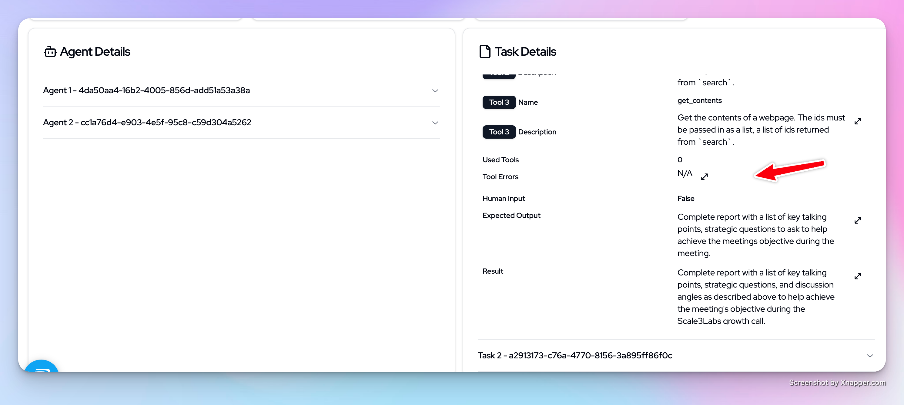

## Creating Crew AI crew for meeting prep
Follow the instructions below to run the CREW AI meeting prep agent and integrate it with Langtrace

### 1. Install Langtrace and other requirements in Terminal

```bash
pip install -r requirements.txt
```
#### Export environment variables
```python
export LANGTRACE_API_KEY=<your-api-key>
export OPENAI_API_KEY=<your-openai-api-key>
```

Note: If you are self-hosting, set the LANGTRACE_API_HOST environment variable to the URL of your Langtrace instance.

```
export LANGTRACE_API_HOST=<your-langtrace-instance-url>
```

### 2. Run the main.py file 
```python
python3 main.py
```
### 3. Visit Crew AI Dash in your Langtrace dashboard to see details about Crew AI events, agents and tasks.


### 4. Use the insights from Langtrace to help troublehsoot your application and identify bottlenecks

#### Langtrace allows us to see what tools out CREWAI tasks as using, if it takes any human input, what errors are being thrown by our Crew AI tasks and much more

