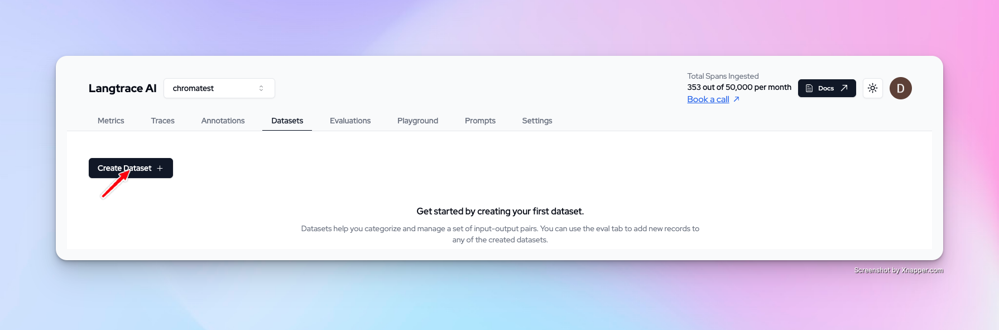

## Working with Datasets on Langtrace

Datasets are crucial for evaluations. To run evaluations in Langtrace, you must first create a dataset.

This playbook demonstrates how to create Datasets and the different ways to to add data to datasets on Langtrace.

### 1. Login into Langtrace.ai and create a dataset

### 2. Add data from captured traces to your dataset

If you have previosuly captured Traces with Langtrace then go to the annotations tab on Langtrace.ai.

You can then select which traces you would like to add to your dataset. Click the add to dataset button and choose the desired dataset you would like to add to.

### 3. Manually add data to your datset

Langtrace allows you to manually input data into your dataset.

Simply head over to your desired dataset. Click the create data button  and fill in the form.

