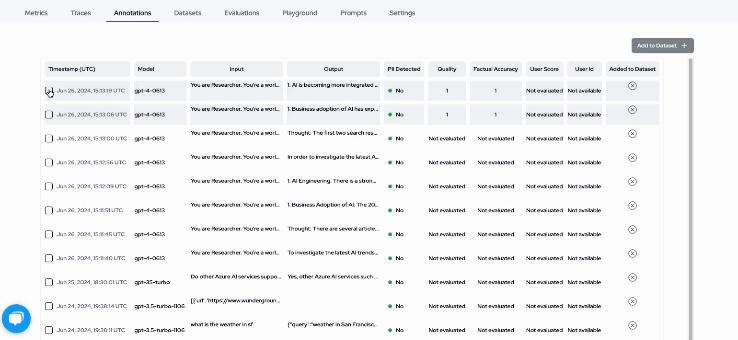

## Running Evaluations on Langtrace

Langtrace allows you run evaluations on annotated datasets as well as your own datasets and get insights on the performance of your application.

This playbook demonstrates how to run Evaluations on Langtrace.

### 1. Install LangTrace and Inspect AI

```python
pip install langtrace-python-sdk
pip install inspect-ai
```
#### Export environment variables
```bash
export LANGTRACE_API_KEY=<your-api-key>
```

Note: If you are self-hosting, set the LANGTRACE_API_HOST environment variable to the URL of your Langtrace instance.

```bash
export LANGTRACE_API_HOST=<your-langtrace-instance-url>
```

### 2. Create a dataset and copy the dataset ID

If you have not already done so create a dataset and add some data.

Copy the dataset ID. 


### 3. Add data from captured traces to your dataset

If you have previosuly captured Traces with Langtrace then go to the annotations tab on Langtrace.ai.

You can then select which traces you would like to add to your dataset. Click the add to dataset button and choose the desired dataset you would like to add to.



### 4. Manually input data for evaluations

If you have data you would like to evaluate that has not been captured by Langtrace, you can manually input your data.


### 4. Annotate your data

Head over to the annotations tab. Select your desired trace and annotate it based on factual accuracy and quality. You can also create your own tests to annotate data by clicking the create test button.

Think of annotations as manual evaluations.


### 5. Write a simple evaluation script and save it in a file called example_eval.py

```python
from inspect_ai import Task, task
from inspect_ai.dataset import csv_dataset
from inspect_ai.scorer import model_graded_qa
from inspect_ai.solver import chain_of_thought, self_critique

@task
def example_eval():
    return Task(
        dataset=csv_dataset("langtracefs://<datasetId>"),
        plan=[
            chain_of_thought(),
            self_critique()
        ],
        scorer=model_graded_qa()
    )


```

### 6. Run the evaluation script
Note that in order to run the script you will need to export the OPEN AI environment variable. We are using the OPEN AI GPT-3.5 model for this evaluation but you can use various LLM providers as stated in the [Inspect AI](https://ukgovernmentbeis.github.io/inspect_ai/) docs

```bash
export OPENAI_API_KEY=<your_openai_api_key>
```
Run the script
```bash
inspect eval example_eval.py --model openai/gpt-3.5-turbo --log-dir langtracefs://<datasetId>
```
### 7. Additionally, you can also configure the --log-dir as an environment variable as shown below:

```bash
export INSPECT_LOG_DIR=langtracefs://<datasetId>
```

### 8. If you want to run evaluations on your own datasets, you can set up your evaluation script as shown below:

```python 
from inspect_ai import Task, task
from inspect_ai.dataset import csv_dataset
from inspect_ai.scorer import model_graded_qa
from inspect_ai.solver import chain_of_thought, self_critique

@task
def example_eval():
    return Task(
        dataset=csv_dataset("./path/to/your/dataset.csv"),
        plan=[
            chain_of_thought(),
            self_critique()
        ],
        scorer=model_graded_qa()
    )
```

### 9. Run the evaluation script by simply passing langtracefs:// to the --log-dir flag.

```bash
inspect eval example_eval.py --model openai/gpt-3.5-turbo --log-dir langtracefs://
```

### 10. Go to the Evaluations tab in the Langtrace dashboard to view the evaluation results.


### 11. Additionally, inspect has a built-in web interface that you can use to view the evaluation results. It works inside VSCode as well as on the browser. You can access the web interface by running the following command:

```bash
inspect view --log-dir langtracefs://<datasetId>
```


